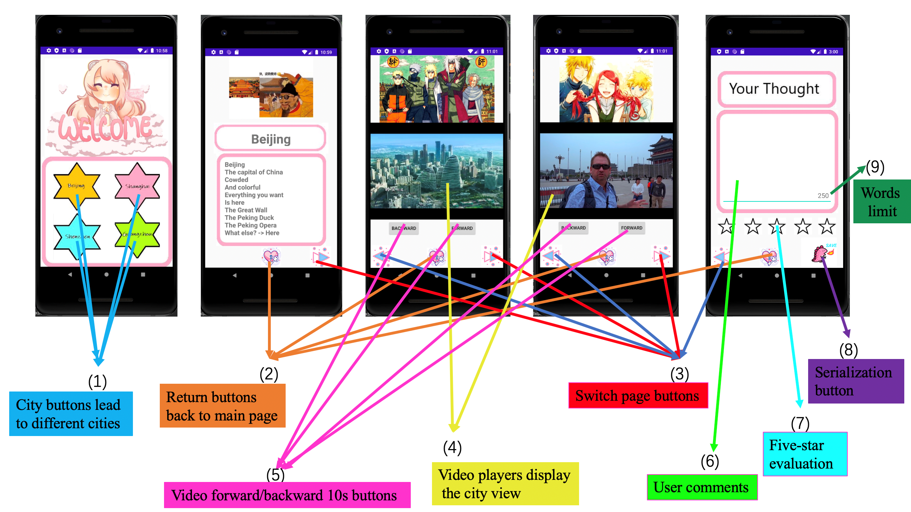

# City App

This is an Android app that introduces users to the famous Chinese scenic spots. There are several features in this app. The user can choose four cities to visit which are Beijing, Shanghai, Shenzhen, and Guangzhou. Each city will contain different descriptions and videoes. In the end, the user can also rate the city that they visit and write their thought. The comment and rating will be store as a file. The app integral with YouTube API to retrieve and control the video. Also, it uses the serialization process to convert the user input into JSON format. The basic layout of the app is designed through the XML file.

## Screenshots

